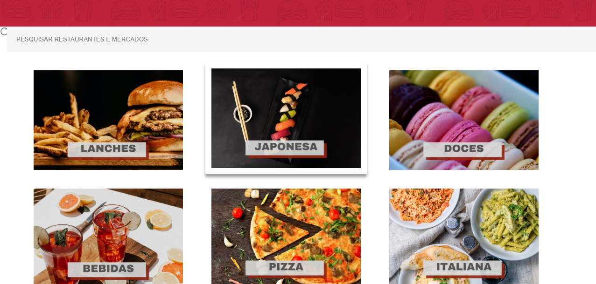

<h1>Este projeto é uma amostra de site de delivery de comida.</h1> 
Em desenvolvimento. 
Ferramentas e linguagens utilizadas:

- CSS
- HTML
- JavaScript
- Bootstrap
- Canva
- Visual Studio Code

<h4>Página inicial/Banner:</h4>
 

<h4>Menu de categorias:</h4>
 

